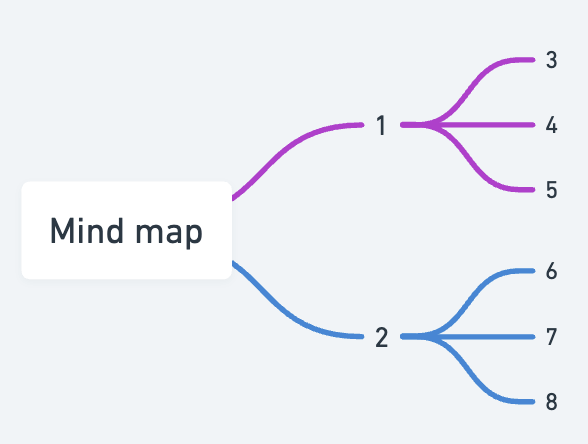
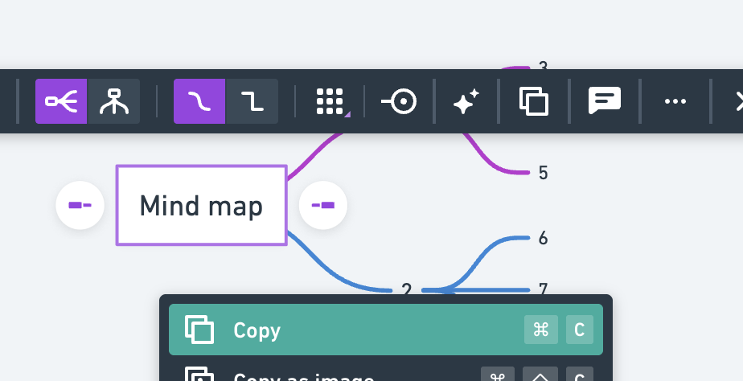
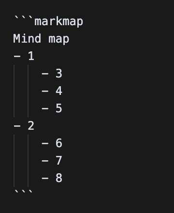
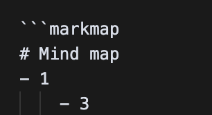

import { Aside, Steps, Code } from '@astrojs/starlight/components';

## Mindmapping

```markmap
---
markmap:
  pan: false
---
- 마인드맵
  - 장점
    - 인간 사고 과정 최적화
    - Overview 표현에 최적
  - 단점
    - 자세한 기록은 보기 어려울 수 있음
  - 특징
    - 구조(Tree)
      - Depth
      - Breadth
        - Peer Nodes
          - Sibling Nodes
          - Cousin Nodes
```

마인드맵은 인간 사고 과정에 최적화된 도구이다.  
다른 개발자의 이해를 돕기 위해 빙글 개발 문서에 통합된 <a href="https://markmap.js.org" target="_blank">markmap</a>을 사용, 마인드맵을 첨부할 수 있다.  
마인드맵을 외부 서비스 <a href="https://whimsical.com" target="_blank">Whimsical</a>에서 생성, 복사해 올 수도 있다. (추천)

### 사용법
Whimsical 활용
<Steps>
1. <a href="https://whimsical.com" target="_blank">Whisical에서 마인드맵 생성</a>
  
2. 원하는 루트 클릭 후 복사 (`Cmd + C`)
  
3. 붙여넣기 (`Cmd + V`)
  
4. 루트에 `#` 붙이기
  

</Steps>

```markmap
---
markmap:
  pan: false
---
# Mind map
- 1
    - 3
    - 4
    - 5
- 2
    - 6
    - 7
    - 8
```
